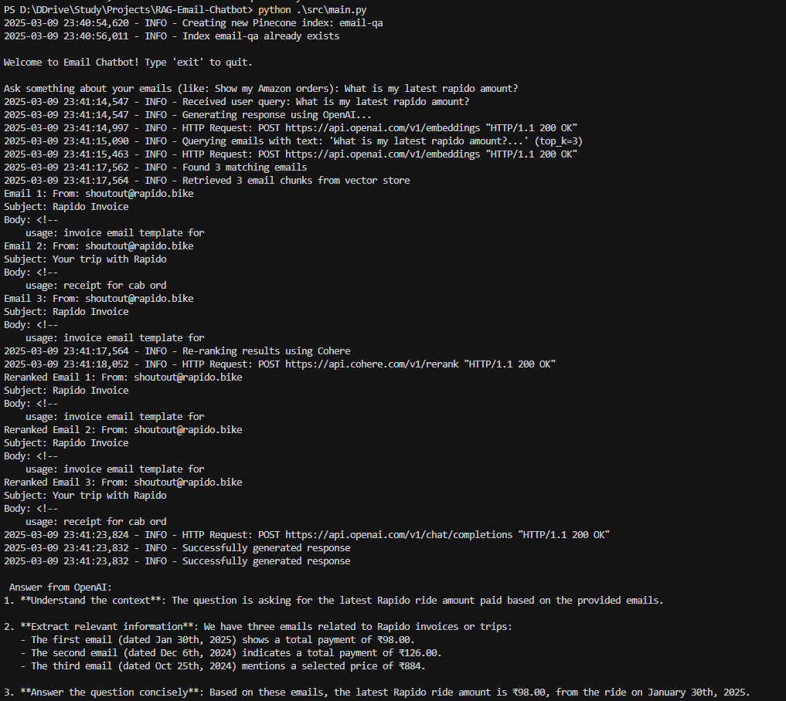

# RAG-Email-Chatbot

A Retrieval-Augmented Generation (RAG) based chatbot for email interactions. This project implements an intelligent email assistant that can understand and process email content using advanced language models and RAG techniques.


## Features

- Email processing and analysis
- RAG-based response generation
- Gmail API integration
- Pinecone based Vector Database
- OPENAI for embeddings and as generator

## Example


## Prerequisites

- Python 3.8 or higher
- `uv` package manager (for dependency management)
- Gmail API credentials

## Installation

1. First, install `uv` if you haven't already:
```bash
pip install uv
```

2. Clone the repository:
```bash
git clone https://github.com/yourusername/RAG-Email-Chatbot.git
cd RAG-Email-Chatbot
```

3. Create and activate a virtual environment using `uv`:
```bash
uv venv
.venv/Scripts/activate  # On Windows
source .venv/bin/activate  # On Unix/MacOS
```

4. Install dependencies using `uv`:
```bash
uv pip install -r requirements.txt
```

## Configuration

1. Create a `.env` file in the root directory with the following variables:
```
OPENAI_API_KEY=<your_openai_api_key>
PINECONE_APT_KEY=<your_pinecone_key>
COHERE_API_KEY=<your_cohere_key>
```

2. Set up Gmail API credentials:
- Go to the [Google Cloud Console](https://console.cloud.google.com/)
- Create a new project or select an existing one
- Enable the Gmail API
- Create credentials (OAuth 2.0 Client ID)
- Download the credentials and save as `credentials.json` in the project root

## Running the Project

1. Ensure your virtual environment is activated:
```bash
.venv/Scripts/activate  # On Windows
source .venv/bin/activate  # On Unix/MacOS
```

2. Run the main application with ingest to upsert emails in vector db:
```bash
python ./src/main.py --ingest
```

3. Run the main application (chatbot mode):
```bash
python ./src/main.py
```


## Project Structure

```
RAG-Email-Chatbot/
├── src/               # Source code
│   ├── __init__.py   # Package initializer
│   ├── main.py       # Main application entry point
│   ├── mail.py       # Email handling and Gmail API integration
│   ├── generator.py  # RAG-based response generation
│   ├── vector_db.py  # Vector database operations
│   └── utils.py      # Utility functions and helpers
├── tests/            # Test files
├── logs/             # Application logs
├── requirements.txt  # Project dependencies
└── .env             # Environment variables
```

## TODO
- Email text cleaning function
- Open source encoder
- Option to change LLM
- Add open source LLMs.
- Code cleanup
- Add testcases using tox.
- Create Docker Image.

## License

This project is licensed under the MIT License - see the [LICENSE](LICENSE) file for details.

## Contributors

<a href="https://github.com/sahilrider">
  
  <br />
  <sub><b>Sahil Kumar</b></sub>
</a>
